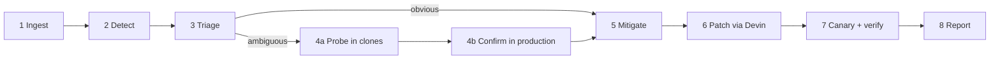
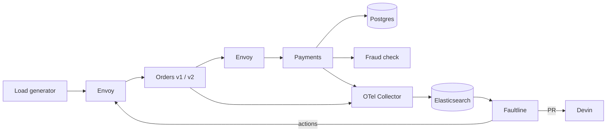

# Faultline PRD v6

2026-09-19 · @Someone

## Summary

**When everything breaks at once, dashboards can't tell you why. Faultline runs the experiment that can, and that experiment is usually the fix.**

Faultline is an autonomous incident responder that plugs into any OpenTelemetry-instrumented system. It triages obvious incidents from telemetry, and when several causes fit the symptoms, it spins up disposable clean copies of the system where investigator agents reproduce each hypothesis and measure how it responds to intervention, then runs one safe, reversible production experiment that tells them apart. It then mitigates, ships a Devin-written fix through a self-verified canary, and leaves a report for a human.

What changed from v5 (v4 → v5 changes kept below):

- **Clone lab.** Observation tells you *what* is happening, not always *why*, and production is too risky for aggressive experiments. Faultline now spins up disposable, healthy copies of the system where investigator agents try to reproduce each hypothesis, run counterfactual experiments and attack Devin's patch before anything touches production.
- **Evidence chain:** passive telemetry ambiguous → clones reproduce each hypothesis and measure how each responds to candidate experiments → a short, controlled production probe confirms → mitigation. The production experiment stays; the clones make it better chosen and its predictions measured rather than guessed.
- **Three environments,** strictly separated: production (hidden real cause, C3 levers only), clean clones (C6 lab actions), benchmark controller (C5, hidden from everyone).
- **Fixes are verified twice:** replayed against the reproduced incident in a clone, then canaried in production.
- **Identity:** an autonomous experimental debugger: it gives debugging agents disposable copies of a failure so they can run counterfactual experiments, falsify hypotheses and validate fixes.

What changed from v4:

- **Plug-in, not a bespoke sandbox.** Faultline talks to a system only through adapters. The sandbox is treated as a customer system.
- **New hero scenario.** Self-sustaining retry storm vs. degraded DB, which stays ambiguous under full, realistic telemetry. The v4 fraud-check vs. DB pair leaked through traces and becomes the easy case.
- **Predictions come from the LLM and the service graph,** judged against measured noise. The calibrated response library and rearm oracle are cut. (Clones were cut in v5; v6 brings back a minimal clone lab.)
- **The LLM proposes and explains; measurement decides.**
- **Two-tier remediation with autonomy:** reversible mitigations run immediately; code ships only through a canary Faultline verifies itself.
- **Question changed** from "what started it" to "what is sustaining it now."
- **Benchmark:** own sandbox set plus the public OpenTelemetry Demo.

## Problem

In distributed systems one failure spreads: a slow component causes timeouts, timeouts cause retries, retries cause overload. By the time an engineer looks, every service is red and several causes fit the same symptoms.

The worst version is a **metastable failure**: the trigger is gone, but the system stays broken because retries keep it overloaded, like a traffic jam that outlasts the accident.

- At least 4 of 15 major AWS outages in a decade were metastable, lasting 1.5 to 73 hours ([OSDI '22](https://www.usenix.org/conference/osdi22/presentation/huang-lexiang), [summary](https://muratbuffalo.blogspot.com/2026/07/characterizing-metastable-faults-and.html)).
- Retry policy was a sustaining cause in about half the studied incidents ([summary](https://www.micahlerner.com/2022/07/11/metastable-failures-in-the-wild.html)).
- Researchers describe detecting and recovering from them as open problems ([Penn State](https://sites.psu.edu/timothyz/metastable-failures/)).
- On live SRE benchmarks, agents often mitigate without a correct diagnosis ([SREGym](https://benchmarklist.com/benchmarks/sregym/)), and frontier models score below 50% on incident root-cause analysis ([ITBench-AA](https://artificialanalysis.ai/articles/itbench-aa-launch)).

**Why dashboards can't answer it.** The key question is often counterfactual: *is the DB slow because we're overloading it, or are we overloading it because it's slow?* A saturated DB looks "full" either way. The only way to learn what latency would be at normal load is to lower the load and look.

## Product

Faultline runs an 8-stage pipeline; experiments run only when triage says the incident is ambiguous. Stage numbering is unchanged from v5 (the C4 audit contract depends on it); the clone probe is part of stage 4.



| Stage | What happens |
| --- | --- |
| 1 Ingest | Traces, metrics, logs and change events via OpenTelemetry, stored in Elasticsearch |
| 2 Detect | SLO alert fires, e.g. checkout p99 above 1 s for 60 s |
| 3 Triage | Service graph + LLM rank candidate causes; obvious ones skip to stage 5 |
| 4 Experiment | **4a Probe:** per hypothesis, an investigator agent gets a clean clone, injects the hypothesized cause, tries to reproduce the production fingerprint, and measures how that world responds to candidate experiments. **4b Confirm:** apply the gentlest production intervention that separates the surviving hypotheses (predictions now measured in clones) and judge the response against noise |
| 5 Mitigate | Keep a reversible action, often the experiment that won |
| 6 Patch | Devin writes the durable fix as a PR; the patch is replayed against the reproduced incident in a fresh clone before it may canary |
| 7 Canary | New version gets \~5% of traffic, compared against old; auto-promote or auto-revert |
| 8 Report | Timeline, evidence, actions, PR link, for human review |

Core principles:

- **Plug-in.** Three adapters only: telemetry in, actions out, code via GitHub + Devin. Faultline never imports the target's code.
- **Find what sustains it.** Vocabulary is **trigger** (what started it) and **sustaining cause** (what keeps it broken now).
- **Confirmation, not elimination.** A diagnosis must pass its own positive test.
- **Admit ignorance.** If no hypothesis passes its confirmation test, report none-of-the-above and page a human with the evidence.
- **Prefer diagnoses you can reproduce.** A hypothesis earns support by reproducing the production fingerprint in a clean clone from its own injected cause, not by LLM confidence.
- **Aggressive in clones, gentle in production.** Clones may disable retries, halve capacity, kill services and replay the incident repeatedly; production only gets C3 levers with TTLs.

## Hero scenario: storm vs. degraded DB

The hero is two hidden worlds that look identical on the dashboard and respond oppositely to one cheap experiment: cap retries, then release.

**Setup (illustrative numbers).** Users send 80 checkouts/s. Orders → Payments → one Postgres query each. DB comfortably handles \~100 queries/s. Orders times out at 500 ms and retries up to 3 times (4 attempts).

**World A: self-sustaining storm (H\_meta).** A 20 s DB hiccup pushes queries past 500 ms. Orders retries; timed-out queries still run in the DB, so load climbs to \~320/s. The hiccup ends and the DB is healthy again, but 320/s keeps it overloaded, so timeouts and retries continue indefinitely.

**World B: degraded DB (H\_db).** A runaway batch job cuts the DB to \~40 queries/s for the app. 80/s exceeds that, so timeouts and retries push load to \~320/s.

| Dashboard signal | World A | World B |
| --- | --- | --- |
| Queries/s at DB | \~320 | \~320 |
| Retries per request | \~4 | \~4 |
| DB query time | > 500 ms | > 500 ms |
| Pool / DB busy | 100% | 100% |
| Checkout errors | very high | very high |
| Hidden truth: DB capacity | \~100/s | \~40/s |

**The experiment: cap retries at 0 for \~20 s, then remove the cap.**

| Measurement | World A | World B |
| --- | --- | --- |
| DB query time while capped | Falls to normal | Stays high |
| After the cap is removed | Stays healthy (loop broken) | Storm returns |
| Diagnosis | Storm; the cap was the fix | DB degraded; fix the DB |
| Confirmation test | Stays healthy after release | DB failover / pause job restores it |

The experiment is cheap: during a storm nearly every checkout already fails. In World A it is also the mitigation.

**What the clones add in the hero.** Both hypotheses reproduce the steady-state fingerprint in a clone (that is what makes the hero ambiguous, and why the ambiguity check below still applies). Clones therefore don't pick the winner on their own. They (1) show both hypotheses are live, (2) *measure* each world's response to each candidate production experiment, replacing LLM-guessed direction predictions, (3) select the gentlest production probe that separates them, and (4) falsify hypotheses that fail to reproduce (e.g. CPU starvation doesn't saturate the DB pool). The production retry cap is still the discriminating, confirming test.

**Go/no-go gate (first \~3 hours). Status: passed** (storm persists 60 s+ after the trigger; retry cap heals it permanently, 5/5 runs; see `sandbox/README.md`). Starting settings: DB `cpus: 0.5`, client timeout 300–500 ms, 3 retries, no backoff, load near capacity; trigger with a 20 s DB delay. Pass = storm persists 60 s+ after the trigger ends, and capping retries ends it permanently. Start from the metastability researchers' examples ([repo](https://github.com/lexiangh/Metastability)); credit any reused code.

**Fallback hero.** If the gate fails: slow fraud-check dependency vs. slow DB, with the fraud check as an uninstrumented vendor library (no span), a stated assumption.

**Ambiguity check.** Before building further, run a nearest-centroid classifier and a passive LLM on both worlds' steady-state telemetry. If either separates them reliably, move World B's cause somewhere typically uninstrumented.

## Clone lab (stage 4a)

The clone lab is where Faultline generates evidence that production telemetry can't give it, without risking users.

**Three environments, never mixed:**

| Environment | Knows the hidden cause? | Who acts on it | Allowed actions |
| --- | --- | --- | --- |
| Production | Yes, but invisible to Faultline and investigators | Faultline orchestrator | C3 levers only (retry cap, shed, DB failover, canary), each with a TTL |
| Clean clone | No, starts healthy | One investigator agent | C6 lab actions, clone-only |
| Benchmark controller | Yes (it injected it) | bench/ and the demo script | C5 faults on production; never visible to Faultline |

**What a clone inherits.** Only what Faultline may legitimately know: service versions and images, config, retry/timeout policy, topology, and a replayable workload (request rate and pattern reconstructed from telemetry). **Never** the hidden fault or fault-controller state; copying the faulty environment would leak ground truth and make reproduction meaningless.

**Investigator loop** (one agent per hypothesis, OpenAI API): given the hypothesis, its clone, the service graph, the production fingerprint, prior experiment history, the C6 action catalog and an experiment budget:

observe → choose experiment → predict outcome → execute in clone → measure → compare → update belief

Experiments are chosen because hypotheses predict different outcomes for them, not as random chaos testing.

**Evidence rules** (what counts; judged by math, not the LLM):

1. **Reproduces:** the hypothesized cause, injected into a clean clone, produces a fingerprint within noise of production.
2. **Predicts:** the hypothesis correctly predicts the clone's response to an intervention.
3. **Survives falsification:** it survives an experiment designed to break it.
4. **Explains recovery:** removing the hypothesized condition restores the clone.
5. **Confirmed in production:** the production probe (4b) behaves as the clone measurements predicted.

A hypothesis that fails 1 is dropped before touching production. If none reaches 5: none-of-the-above, page a human.

**C6 action catalog (clone-only, \~6–9 primitives):** create/reset/destroy clone, replay workload, set retry count, set timeout, inject dependency/DB latency, change DB/CPU capacity, pause/resume batch workload, restart/kill service, clone metadata/status. **C6 actions are never production actions**, and C6 never exposes the hidden world.

**Patch verification.** Devin's patch runs as orders-v2 in a fresh clone; the reproduced incident is replayed, plus a transient DB slowdown, higher load and CPU degradation. Only a patch that survives goes to the production canary.

**Budget.** Production + 2 concurrent investigation clones; 3 clones maximum after profiling on the final demo machine (each clone is \~8 containers). No swarm: two visible investigators communicate the idea.

**Not building:** VM snapshots, Kubernetes, full production traffic capture, arbitrary shell agents, dozens of chaos primitives, large multi-agent swarms, complex Bayesian inference, perfect environment reconstruction.

## Other scenarios

Two supporting scenarios show that Faultline handles easy incidents cheaply and admits when an incident fits nothing it knows.

| Scenario | Setup | Expected behavior | Priority |
| --- | --- | --- | --- |
| Easy case | Fraud-check dependency slow, visible as its own span | Triage names it with no experiment; mitigation = fail over the dependency | If ahead |
| None-of-the-above | Payments CPU starved (noisy neighbor); per-container CPU not collected | Looks like the hero; fails both confirmation tests (cascade returns after retry release; DB failover does nothing) → none-of-the-above, page a human. In clones, neither H_meta nor H_db reproduction matches it perfectly | Benchmark, maybe demo |

None-of-the-above rule: **no hypothesis passed its own confirmation test.** On the OpenTelemetry Demo, any flag outside the hypothesis list (e.g. Kafka consumer lag) serves the same purpose.

## Levers and how fixes are applied

Every *production* experiment, mitigation and code fix is a **lever** pulled through an adapter (C3), with a registered undo, a blast radius and a speed. Clone experiments use the separate C6 lab catalog and never touch production.

| Lever | Examples | Sandbox mechanism | Build? |
| --- | --- | --- | --- |
| Traffic | Shed 10% / 50%, canary split | Envoy weights and rate limits | Yes |
| Call policy | Cap retries, timeouts, backoff | Orders runtime override endpoint | Yes |
| Dependencies | Fail over fraud check, DB failover / pause batch job | Config switch; pause the load job | Yes |
| Code | Backoff + jitter, timeout + circuit breaker | Devin PR → orders-v2 container → Envoy canary | Yes |
| Capacity | Scale replicas, grow pool | `docker compose --scale`, pool config | Describe only |
| Changes | Roll back deploy, revert flag | Image tags, flags file | Describe only |
| State | Restart, kill stuck query | `docker restart`, Postgres admin | Describe only |

**Lifecycle, identical for every lever:**

1. Propose (LLM, from the adapter's catalog).
2. Safety check: reversible, within action budget, acceptable blast radius. Otherwise refused.
3. Apply via adapter.
4. Watch 15–30 s (config) or a few minutes (canary).
5. Judge: did target metrics move as predicted, beyond noise?
6. Keep if better; run the undo if worse or unclear.
7. Record in the audit log.

**Code = same loop plus clone verification plus a canary.** Devin opens a PR; Faultline first runs it as orders-v2 in a fresh clone against the replayed incident and stress variants (fails → evidence back to Devin); then builds orders-v2 beside orders-v1 in production; Envoy sends 5% to v2; compare v2 vs v1; promote gradually or set v2 weight to 0. If verification fails, send the measured evidence back into the same Devin session for a revision. A prebuilt fallback patch keeps the demo independent of Devin's latency.

**Autonomy and guardrails.**

- Automatic: telemetry reads, triage, reversible actions.
- Canary-gated: code.
- Human after the fact: merging, refactoring, reviewing the report.
- Never irreversible actions; action budget of 5 per incident, then page a human; auto-undo on regression; kill switch; full audit log.

Coverage: the performance and availability class (bad changes, overload, slow dependencies, metastable storms, resource exhaustion, queue backlog, bad nodes, hot keys, cache stampedes). Out of scope: silent wrong answers, data corruption and consistency bugs, slow-burn leaks, systems with no levers.

## LLM vs. measurement

The LLM proposes and explains; measurement decides. This keeps diagnoses checkable and answers the judge's "isn't this just an LLM guessing?"

| Job | Owner |
| --- | --- |
| Summarize telemetry fingerprint and logs | LLM (OpenAI API) |
| Propose hypotheses | LLM |
| Predict each hypothesis's response to each candidate lever | LLM, structured output |
| Propose candidate experiments from the adapter catalog | LLM |
| Estimate baseline noise | Math |
| Rank experiments: separation vs. blast radius | Math |
| Judge result against noise; update support; confirmation check | Math |
| Investigator: choose the next clone experiment and predict its outcome | LLM (one agent per hypothesis) |
| Reproduction similarity, falsification verdicts in clones | Math |
| Predictions for the production probe | Measured in clones (LLM fallback if no clone ran) |
| Mitigation choice, Devin request, report | LLM + Devin |

**Prediction schema (per hypothesis × experiment):**

```json
{"hypothesis": "H_meta", "experiment": "cap_retries_0_20s",
 "during": {"db_query_p50": "down", "db_qps": "down", "checkout_errors": "down"},
 "after_release": {"db_query_p50": "flat", "retry_ratio": "flat"},
 "confirms_if": "after_release stays at baseline"}
```

**Noise.** Record several healthy windows; per metric, noise σ = max(measured std, 10% of typical value). A change counts only if it exceeds \~3σ in the predicted direction.

**Planner.** For each candidate lever: separation = number of metrics where hypotheses predict different directions, weighted by how far each is expected to move in σ units. Score = separation − λ · blast radius (% of user requests affected). Pick the smallest intervention that clears the noise, e.g. retry cap (0% of successful requests dropped) before shedding 50%.

**Support.** Uniform prior; each experiment updates support from agreement between predicted and measured directions. Declare a diagnosis only when the leader passes its confirmation test; if none passes, none-of-the-above.

The UI shows two panels side by side: *LLM reasoning* and *measured evidence*.

## Architecture

Two separate codebases: the **target system** (sandbox) and **Faultline**, which touches the target only through adapters.



**Target system (Docker Compose):**

- Services: Gateway/Envoy, Orders, Payments, fraud-check stub, Postgres (limited CPU), load generator. FastAPI, trivial business logic.
- Envoy in front of Orders and between Orders and Payments: timeouts, traffic weights, shedding, canary split. Retries live in Orders' own code (the thing Devin patches), with a runtime override endpoint for the retry-cap lever.
- Fault controller (hidden from Faultline): DB delay trigger, batch-job load (World B), CPU limit (none-of-the-above).
- **Clone runtime:** isolated Compose replicas of the target (own project, network and ports), each with its own lab API (C6): create/reset/destroy, workload replay, lab primitives, patched-version slot.
- OTel auto-instrumentation → Collector → Elasticsearch.

**Faultline:**

| Component | Responsibility |
| --- | --- |
| Telemetry adapter | ES queries → per-window fingerprint (p50/p99, QPS, errors, retry ratio, DB query time) |
| Detector | SLO threshold alert |
| Triage | OpenAI call: fingerprint → hypotheses + predictions (schema above) |
| Planner + judge | Noise model, lever ranking, support update, confirmation check |
| Action adapter | Envoy admin/config, config endpoints, compose commands; each with undo |
| Code adapter | Devin API session, poll, pull branch, build v2, canary |
| Clone adapter | C6 client: create/reset/destroy clones, run lab actions, replay workload |
| Investigators | One agent per hypothesis running the investigator loop in its clone |
| Orchestrator | State machine for the 8 stages; launches clone investigations; routes Devin patches through clone verification; audit log in Elasticsearch |
| CLI | `faultline watch`, `investigate`, `experiment`, `report` |
| UI | Latency/load chart, hypotheses + evidence panels, audit log, live investigator/clone panels |

**Fairness rules:** fault-controller state, world labels and trigger timing are never visible to Faultline or its investigators; clones are built only from observable/configurable state; C6 actions only reach clones. On the OTel Demo, filter flagd attributes out of telemetry and never use flag flips as levers.

## Demo

The demo is built around one live chart of **DB query latency and request load over time**; no one touches the keyboard between the incident and the report.

1. **Hook (15 s).** "At least 4 of AWS's 15 biggest outages in a decade were metastable failures. The dashboard can't tell you whether your DB is broken or drowning."
2. **Healthy system,** then the hidden incident hits; everything turns red.
3. **Triage says ambiguous.** Storm vs. degraded DB, both plausible, shown in the reasoning panel.
4. **Two clean clones appear.** Investigator A injects a transient DB hiccup and reproduces the production fingerprint; investigator B injects persistent DB degradation and also reproduces it. Each then measures its world's response to a 20 s retry cap: A heals and stays healed, B snaps back.
5. **Planner picks the retry cap** because the clones measured it as the gentlest probe that separates the worlds, not because the LLM guessed.
6. **The chart moment (production).** Cap on: load and latency drop. Cap off: load returns, **latency stays low**, matching clone A. Diagnosis: self-sustaining storm, confirmed; mitigation already in place.
7. **Contrast (pre-recorded or second live run).** Same experiment on the degraded-DB world: latency snaps back, matching clone B. Same experiment, opposite answers.
8. **Durable fix.** Devin patch → fresh clone replays the reproduced incident plus a new DB slowdown and higher load → survives → canary at 5% → green → promoted.
9. **Morning report + audit log.** Then the benchmark table.

Requirements: record a clean full run as soon as the storm is reliable; rehearse the live run at least 5 times; keep the pre-recorded run as fallback. Show the CLI in Warp for one step.

## Benchmark and evaluation

The headline result: on ambiguous incidents where passive methods are near chance, Faultline's experiments raise diagnosis accuracy, and it correctly reports none-of-the-above and no-incident.

**Why build our own.** Public root-cause benchmarks like RCAEval and ITBench-AA are offline recordings, so they cannot measure acting on a live system. Live benchmarks (SREGym, AIOpsLab) need Kubernetes; SREGym is future work.

| Suite | Incidents | Proves |
| --- | --- | --- |
| Sandbox (required) | \~10 per world: storm, degraded DB, CPU starvation, no-fault; varied trigger size and load; held-out settings | Experiments beat passive diagnosis on ambiguous incidents |
| OpenTelemetry Demo (if ahead) | 10–20 seeded flag incidents incl. lock contention, plus a few combined | Works as a plug-in on a public system we didn't build |

**Arms (identical telemetry input):**

| Arm | Proves |
| --- | --- |
| Passive-only (stage 3, no stage 4) | What existing evidence alone achieves |
| Production experiment only (v5 loop, 4b without 4a) | Active intervention improves diagnosis (**the key comparison**) |
| Clone investigation + production confirmation (v6) | Counterfactual reproduction adds evidence while keeping invasive experiments off production (ablation) |
| LLM-only (LLM picks and judges experiments) | Measurement and judging matter |
| Nearest-centroid on steady-state fingerprints | Simple telemetry classifier baseline |
| Random lever choice | Planner matters |

The headline claim stays passive vs. active diagnosis. The clone arm is an ablation: it should match or beat production-only with fewer or gentler production actions, and it adds reproduction evidence.

**Metrics:** diagnosis accuracy; production actions and user requests affected per diagnosis (clone arm vs. production-only); reproduction success per hypothesis; none-of-the-above rate on the CPU world; false alarms on no-fault runs; mitigation success; time to mitigation; user requests dropped by experiments; consistency across repeated runs (LLM-only vs. Faultline); tokens per incident vs. dumping raw telemetry to the LLM.

**Runtime:** \~2–3 min per incident → run unattended overnight on one machine with code frozen. Report only measured numbers.

## Sponsor plan

We target four primary challenges, each with one visible piece in the demo, plus two low-effort add-ons.

| Challenge | What they judge | What we show | Owner |
| --- | --- | --- | --- |
| Warp: Best Developer Tool | Improving the dev lifecycle (create, modify, test) | Automated debugging and testing for live systems; CLI run in Warp | Product |
| Cognition: Best Use of Devin | Creativity, novelty, polish | Diagnose → Devin patch → canary verify → evidence back to Devin for revision; also use Devin during the build | Product |
| OpenAI | API use + how Codex helped build | API does triage, hypotheses, structured predictions, report; a concrete Codex story from the build log | Brain |
| Elastic: Find the Signal | Elasticsearch turning messy data into insight/action | All telemetry and the audit log in Elasticsearch; triage queries; similar-past-incidents search | Telemetry |
| The Token Company | LLM cost savings in the product | Tokens per incident: compressed fingerprint vs. raw telemetry dump | Brain |
| Ramp | Saves time and money | Time to mitigation vs. a human paging loop | Anyone (write-up only) |

- [ ] Start the Codex log now: what Codex wrote, tested or debugged, with timestamps.
- [ ] Check Runpod when it is announced.
- [ ] Skip challenges requiring tech we don't use (SpaceXAI, Deepgram, ElevenLabs, Meta, hardware).
- [ ] Devpost: one paragraph per sponsor naming exactly where their tool appears.

## Scope, team and timeline

Build the core loop to 100% before any layer; the plan assumes 4 people and a Sunday-morning deadline (confirm both).

**Core (must work end to end):** sandbox + Envoy + load generator; storm and degraded-DB worlds; minimal clone lab (2 investigation clones, \~6 C6 primitives, 2 investigators, patch verification in a clone) working by the 2 am freeze but operationally behind the v5 loop; OTel → Elasticsearch; OpenAI triage with structured predictions; planner over retry cap / shed 10% / shed 50% / DB failover; judge vs. noise; mitigation kept; audit log; Devin → canary → verify → revise with prebuilt fallback; CLI; UI chart + panels; overnight sandbox benchmark.

**If ahead:** none-of-the-above probe in the demo, easy case, OpenTelemetry Demo suite, richer report, similar-incident search.

**Cut:** SREGym, calibrated response library, change attribution, Kubernetes, extra production levers beyond the four, VM snapshots, clone swarms (> 3 clones), full traffic capture.

| Owner | Builds |
| --- | --- |
| Owner | Builds (v5, kept) | Adds in v6 |
| --- | --- | --- |
| 1 Sandbox + storm | Services, Envoy, load generator, fault controller, storm gate | **The lab:** clone runtime (isolated Compose replicas), create/reset/destroy lifecycle, workload/incident replay, reproducible fault states, C6 lab actions (retry/timeout, load, DB latency/capacity, CPU, batch pause, restart/kill), patched-version slot in clones |
| 2 Telemetry + Elastic | OTel, Collector, Elasticsearch, fingerprint queries, audit log store | Clone id on all telemetry, per-clone fingerprints, clone vs. production fingerprint comparison, reproduction-similarity metric, experiment-history storage and queries |
| 3 Brain | OpenAI triage and predictions, noise model, planner, judge, benchmark runner | **The scientist:** investigator agents (one per hypothesis), clone experiment selection, reproduction and falsification scoring, stopping rules, measured predictions for the production probe, clone arm in the benchmark |
| 4 Product | Orchestrator, action and code adapters, Devin + canary, CLI, UI, demo | Launch clone investigations, C6 clone adapter, live investigator panels, send diagnosis + reproduction to Devin, route the patch through clone verification before the production canary |

**Principle:** Owner 1 exposes capabilities (C6); Owner 3 decides when and why to use them.

| Time (Sat → Sun) | Milestone |
| --- | --- |
| now → 3:30 pm | Storm gate passes (or fallback chosen); skeleton services traced into Elasticsearch |
| 3:30 → 9 pm | Ugly end-to-end loop: incident → triage → experiment → diagnosis. In parallel: C6 contract agreed, clone runtime up (Owner 1) |
| 9 pm → 2 am | Devin + canary, chart UI, Elastic queries, CLI. Clone lab: 2 investigators reproduce both hero hypotheses; patch verification in a clone |
| 2 → 6 am | Freeze; benchmark runs unattended; record fallback video; polish |
| 6 am → deadline | Rehearse demo; Devpost write-ups per sponsor |

**Parallel tracks** (v6 clone-lab work in *italics*; ✅ = done):

| Phase | 1 Sandbox + storm | 2 Telemetry + Elastic | 3 Brain | 4 Product |
| --- | --- | --- | --- | --- |
| **→ 3:30 pm** | ✅ Services, Postgres, load generator; storm gate (5/5). ✅ Also done early: Envoy, retry override, World B, fault controller, v2 slot, CPU-starve world, `sandbox/INTEGRATION.md`. *Draft C6 clone-lab contract* | Get OTel → Collector → ES running **first**, then the fingerprint query (sandbox `/stats` mapping in `sandbox/INTEGRATION.md`) | OpenAI triage prompt against C1 fixtures; noise model math; *review and approve C6* | Orchestrator state machine on fake adapters; CLI skeleton; Devin API access check |
| **3:30 → 9 pm** | *Clone runtime: 2 isolated Compose replicas, create/reset/destroy, clean-start fairness test; C6 lab API (\~6 primitives); workload replay from production config* | Live fingerprint adapter; audit-log index; ambiguity-check data export; *clone id on all telemetry, per-clone fingerprints* | Planner + judge + support update on fixtures; ambiguity check (nearest-centroid + passive LLM); *investigator loop for one hypothesis on one clone* | Real action adapters against :9901; **first end-to-end loop (v5) by 9 pm**; *C6 clone adapter* |
| **9 pm → 2 am** | *Incident replay: both hero hypotheses reproducible in clones; patched orders-v2 in a clone with stress variants (DB slowdown, load, CPU); clone lab working by 2 am* | Similar-incident search; tokens-per-incident metric; UI data queries; *clone-vs-production similarity metric; experiment-history queries* | Benchmark runner (uses C5), baselines (passive-only, production-only, LLM-only, centroid, random); *2 investigators, reproduction/falsification scoring, measured predictions for the production probe* | Devin → *clone verification* → build v2 → canary → verify → revise; prebuilt fallback patch; UI chart + two panels + *investigator panels* |
| **2 → 6 am** | Harden storm reliability (✅ 5/5 already); *clone reset reliability; profile production + 2 clones on the demo machine* | Support benchmark runs | Run the overnight benchmark on frozen code (*clone arm if stable*) | Report, record fallback video |
| **6 am →** | Rehearse the demo | Elastic Devpost write-up | OpenAI + Token Co write-ups, Codex log | Warp + Devin write-ups, demo driver |

**Cut order if behind:** OTel Demo suite → Elastic extras (keep storage) → easy case → clone-lab extras (keep 2 investigators, drop the benchmark clone arm) → live canary (show recorded) → Devin live (use fallback patch). If the clone lab threatens the proven storm → experiment → judge loop, fall back to the v5 loop. Never cut: storm, experiment, judge vs. noise, the chart, the benchmark table.

## Definition of done

The project is done when a judge watching the demo can see all twelve of these, and the build checks below pass. Interface details live in the [Contracts](file/d0142742-f4d4) tab.

**What a judge must see:**

1. Many components look broken at once, and the dashboard alone doesn't say why.
2. Faultline's triage names two plausible causes and says the telemetry can't separate them.
3. The LLM's reasoning and the measured evidence appear as separate panels.
4. The planner picks an experiment for a stated reason: separation vs. user impact.
5. The experiment runs live on the incident, and the chart shows the response.
6. The verdict comes from measurement against noise, not an LLM opinion.
7. The diagnosis passes its own confirmation test (stays healthy after the cap is released).
8. The same experiment gives the opposite answer on the degraded-DB world.
9. A Devin patch ships through a canary that Faultline verifies itself.
10. A benchmark table shows experiments beating passive-only and LLM-only on ambiguous incidents.
11. Two investigators each reproduce their hypothesis in a clean clone and measure its response to the retry cap before production is touched.
12. The Devin patch survives a replay of the reproduced incident in a clone before its canary.

**Build checks:**

- [x] Storm gate passed: storm persists 60 s+ after trigger ends; retry cap ends it permanently, in 5 of 5 tries.
- [ ] Clones start healthy and inherit no hidden state (fairness test); C6 actions cannot reach production.
- [ ] Both hero hypotheses reproduce the production fingerprint in clones; CPU starvation reproduces neither.
- [ ] Ambiguity check: nearest-centroid and passive LLM near chance on storm vs. degraded DB.
- [ ] Full loop runs unattended from incident to report with no manual steps.
- [ ] Every action in the audit log has a recorded undo, and a regression triggers it automatically.
- [ ] Benchmark run completed on frozen code; numbers on slides match the run output.
- [ ] Fallback video recorded; prebuilt patch works if Devin doesn't return in time.
- [ ] Each primary sponsor's tool is visible at a named moment in the demo.

## Risks, limits and open items

The biggest risk is scope; the second is a storm that won't reproduce reliably.

| Risk | Mitigation |
| --- | --- |
| Too much to build | Core loop first; cut order above |
| Storm doesn't sustain or doesn't break | 3-hour gate; researchers' examples; fallback hero |
| Telemetry separates the worlds passively | Ambiguity check first; move World B's cause somewhere uninstrumented |
| Live demo flakiness | Record clean run early; rehearse 5+ times |
| Looks like another AI-SRE tool | Chart moment is the center of the demo |
| Devin slow or unavailable | Prebuilt fallback patch; show the session separately |
| Clone lab threatens the core loop | Behind the v5 critical path; fall back to v5 at any point |
| Clones overload the demo machine | Production + 2 clones; 3 maximum after profiling |
| Clone reproduction leaks the hidden world | Clones built only from observable state; fairness test; C5 never reachable from investigators |
| Overclaiming clone evidence | In the hero, both hypotheses reproduce; clones measure predictions and falsify, production confirms |
| Non-infra judges | Traffic-jam analogy; chart readable without vocabulary |

**Claims discipline.**

- Say "handles performance and availability incidents," never "handles everything."
- Say "prevents the storm from recurring," not "fixes the root cause," unless the trigger itself was fixed.
- Say "reproduced in a clone," not "proved": a clone is a scaled-down model, and production confirmation is what decides.
- Only measured numbers on slides. Label the sandbox as a scaled-down reproduction.

**Open items:**

- [ ] Confirm submission deadline and team size.
- [ ] Check HackMIT rules on reusing open-source code; credit any reuse.
- [ ] Verify Devin API access with event credentials.
- [ ] Confirm the OTel Demo runs on a team laptop, or drop it.
- [ ] Confirm the demo machine; profile production + 2 clones on it.
- [ ] Agree C6 (clone lab contract) between Owners 1 and 3 before building investigators.
