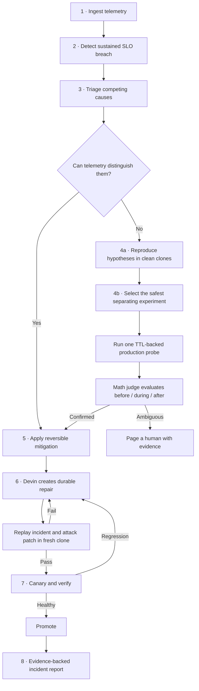
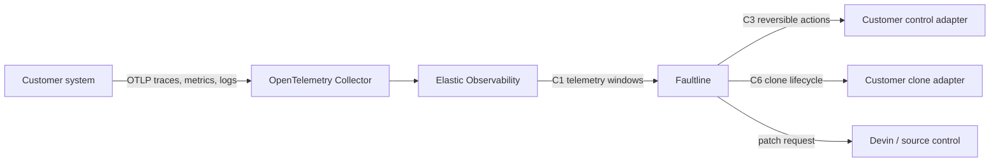
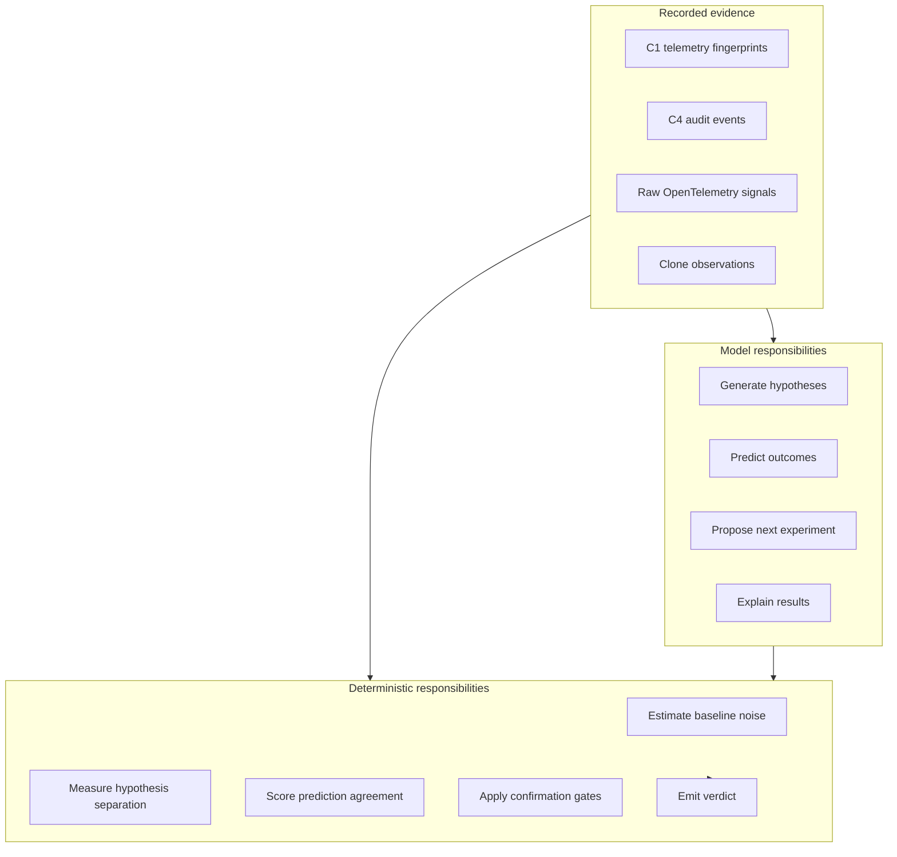
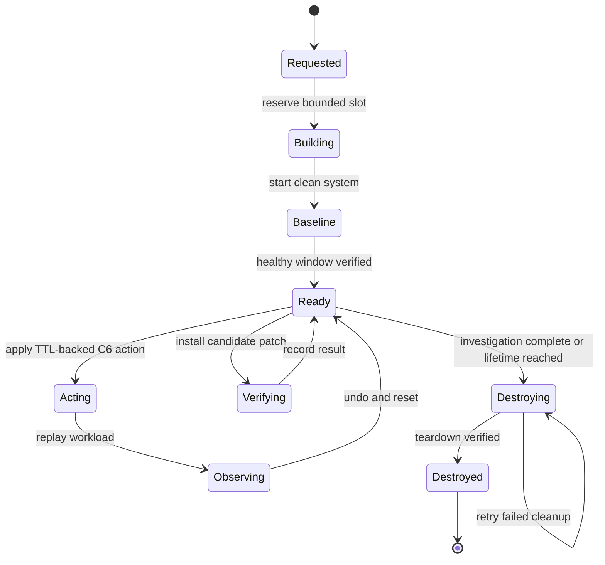
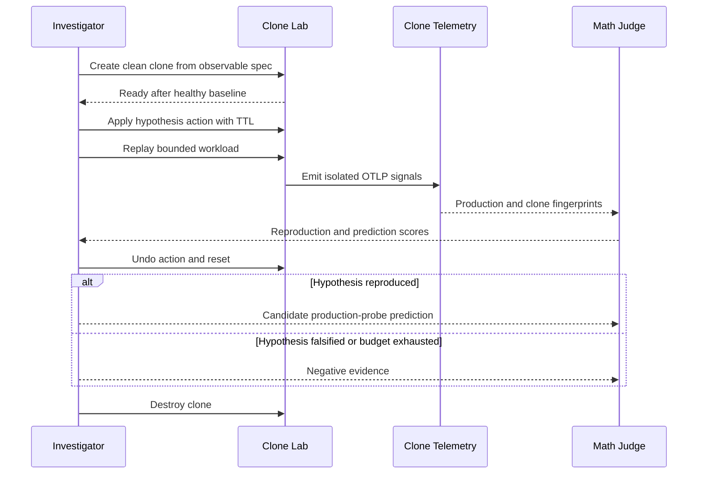
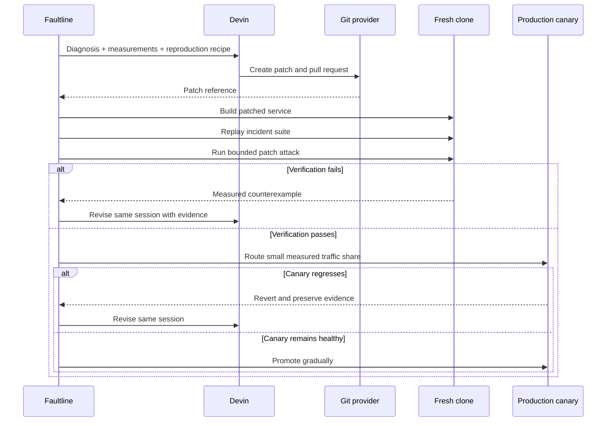
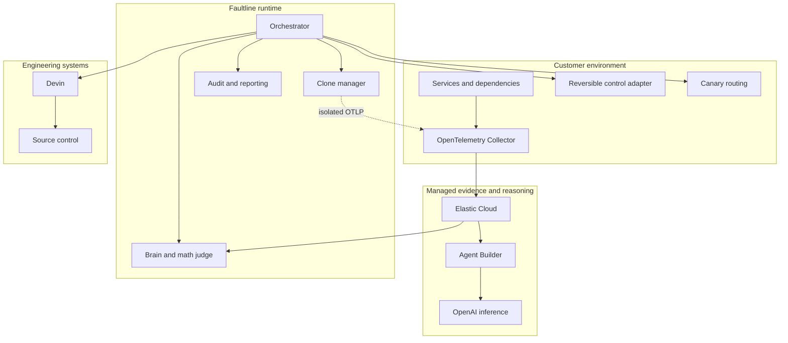

# Faultline

### Autonomous incident response through controlled experimentation

Faultline diagnoses ambiguous production incidents by running safe, reversible experiments against live systems and disposable clones. It connects to any OpenTelemetry-instrumented distributed system, turns telemetry into competing causal hypotheses, reproduces those hypotheses in isolated environments, and uses measured outcomes—not model confidence—to decide what is true.

When a cause is confirmed, Faultline keeps the safest reversible mitigation in place, asks Devin to implement the durable repair, attacks that patch in a fresh clone, and releases it through a measured production canary.

> **The model proposes and explains. Measurement against noise decides.**

## Why Faultline

Distributed-system failures rarely stay local. A slow dependency causes timeouts; timeouts cause retries; retries increase load; and the extra load makes the dependency even slower. By the time an engineer opens a dashboard, many services are red and multiple causes fit the same telemetry.

Consider two incidents with the same visible symptoms:

- A temporary database hiccup has ended, but a self-sustaining retry storm keeps the database overloaded.
- The database is still degraded, and retries are merely amplifying a real capacity problem.

Both can produce saturated connections, high query latency, elevated retry ratios, and failed checkouts. Passive observation can correlate those signals, but it cannot answer the counterfactual question: **what would happen if retry amplification briefly stopped?**

Faultline answers that question experimentally. It caps retries with a TTL, measures the system while the cap is active, releases it, and evaluates what happens next:

| Observation | Interpretation |
| --- | --- |
| The system recovers and stays healthy after release | The retry loop was sustaining the incident |
| Load falls during the cap but the incident returns after release | The underlying dependency remains degraded |
| Neither hypothesis passes its confirmation test | Faultline reports `NONE_OF_THE_ABOVE` and escalates |

## End-to-end system

```mermaid
flowchart LR
    subgraph Target[OpenTelemetry-instrumented system]
        U[User traffic] --> G[Gateway / service mesh]
        G --> S[Application services]
        S --> D[(Databases and dependencies)]
        S -. OTLP .-> O[OpenTelemetry Collector]
        G -. metrics .-> O
    end

    subgraph Elastic[Elastic evidence plane]
        O --> EO[Elastic Observability]
        EO --> ES[(Elasticsearch)]
        ES --> K[Kibana]
        ES --> J[Jina semantic incident memory]
        ES --> AB[Elastic Agent Builder]
    end

    subgraph Faultline[Faultline control plane]
        AB --> AI[OpenAI reasoning roles]
        AI --> B[Hypotheses and predictions]
        B --> P[Experiment planner]
        P --> CL[Clone investigators]
        CL --> M[Math judge]
        M --> L[TTL-backed production levers]
        L --> M
        M --> R[Confirmed diagnosis and mitigation]
    end

    subgraph Repair[Repair and release]
        R --> DV[Devin]
        DV --> PR[Patch / pull request]
        PR --> V[Fresh-clone replay and patch attack]
        V --> C[Measured production canary]
        C -->|healthy| X[Promote]
        C -->|regression| Y[Revert and return evidence]
        Y --> DV
    end

    L --> G
    ES --> CL
    CL -. isolated telemetry .-> ES
```



Faultline separates responsibilities deliberately:

- **Elastic is the evidence and memory layer.**
- **Jina retrieves semantic precedent.**
- **OpenAI generates structured, testable reasoning.**
- **Faultline plans experiments and evaluates measurements.**
- **The clone lab provides safe counterfactual environments.**
- **Devin implements and revises durable fixes.**
- **The canary controller decides whether repaired code reaches users.**

## The incident lifecycle

Faultline operates as an eight-stage state machine.



### 1. Ingest

Services emit standard OTLP traces, metrics, and logs. Faultline converts bounded observation windows into canonical fingerprints containing service health, dependency edges, database behavior, SLOs, log highlights, and recent changes.

### 2. Detect

A detector opens an incident only after a sustained breach. A single noisy window is not enough. Detection state and incident windows are recorded so every later claim can be traced to the data that existed at the time.

### 3. Triage

OpenAI reasoning roles receive a compact incident fingerprint and bounded Elastic context through Agent Builder. They return strict structured output:

- Competing hypotheses
- Supporting and contradicting evidence
- Predicted metric directions for each candidate experiment
- A positive `confirms_if` condition for each hypothesis
- Known blind spots and classes that cannot be evaluated

Schema validation rejects malformed proposals. Semantic validation rejects unknown levers, missing predictions, unbounded actions, and confirmation rules that cannot distinguish the surviving hypotheses.

### 4. Experiment

Each viable hypothesis receives a clean clone. Investigator agents attempt to reproduce the production fingerprint from observable configuration and clone-only actions. The planner then chooses the production experiment with the highest expected separation and lowest blast radius.

Every production action is reversible, TTL-backed, audited, and counted against the incident action budget.

### 5. Mitigate

Once the measurements confirm a cause, Faultline retains or applies the safest reversible mitigation. Irreversible or capacity-changing operations are converted into an evidence packet for human approval.

### 6. Repair

Devin receives the confirmed diagnosis, reproduction recipe, affected services, measured evidence, constraints, and acceptance tests. It creates a patch and pull request. Failed verification is returned to the same session as a concrete counterexample so the patch can be revised without losing context.

### 7. Verify and canary

The patch must first survive the incident replay suite and a bounded investigator trying to falsify it. It is then deployed beside the current version and receives a small measured traffic share. Faultline promotes only while latency, errors, throughput, retries, and dependency load remain compatible with the healthy baseline.

### 8. Report

The final report includes the incident timeline, hypotheses, clone experiments, production actions, measured verdict, mitigation, patch, canary outcome, citations, and unresolved uncertainty. Numerical statements are rendered from recorded evidence rather than generated prose.

## Plug into any OpenTelemetry system

Faultline does not import or depend on an application's implementation. A target system integrates through three boundaries:



### Telemetry adapter

The telemetry adapter maps a system's observable signals into the C1 fingerprint contract. It preserves units, timestamps, missing values, and environment identity. Missing data is omitted rather than converted to zero.

Required integration data is intentionally small:

- Service identity and version
- Request rates, errors, and latency distributions
- Dependency edges and their observable behavior
- SLO measurements
- Change and deployment events
- A stable five-second observation window

### Lever adapter

The C3 lever adapter exposes only reviewed, reversible operations such as retry caps, traffic shedding, failover, and canary weighting. Every operation declares parameters, maximum TTL, blast-radius estimation, status, and undo behavior.

### Clone adapter

The C6 clone adapter creates clean replicas using observable versions, configuration, retry policy, topology, and workload shape. It never copies production secrets, user data, hidden fault state, or benchmark-controller state.

Because these interfaces are stable, the same Brain, planner, judge, orchestrator, and UI can operate against a Docker Compose application, a Kubernetes deployment, or a service platform with its own sandbox provider.

## Evidence, reasoning, and verdict boundaries



The model can suggest that a metric should move. It cannot assert that the metric moved. The judge evaluates recorded before, during, and after-release windows using a per-metric noise model:

```text
sigma = max(observed healthy standard deviation, 10% of the typical value)
```

A confirmation must satisfy all applicable gates:

1. The observed movement is significant relative to baseline noise.
2. It occurs in the predicted direction.
3. The selected experiment separates the surviving hypotheses.
4. A claimed recovery remains valid after the intervention is released.
5. Exactly one tied leading hypothesis passes its confirmation test.

If the gates do not identify one cause, Faultline does not manufacture certainty.

## Elastic, Jina, Agent Builder, and OpenAI

### Elastic Observability

The OpenTelemetry Collector sends production and clone signals into Elastic Observability. Kibana provides service maps, traces, log correlation, and a human-verifiable view of the evidence behind every decision.

### Elasticsearch

Elasticsearch stores both raw observability data and Faultline's structured operational record:

| Data | Purpose |
| --- | --- |
| `faultline-fingerprints` | Canonical production and clone measurement windows |
| `faultline-audit` | Hypotheses, experiments, actions, verdicts, patches, and canaries |
| `faultline-incident-memory` | Curated resolved-incident summaries and reproduction context |
| Reproduction recipes | Executable regression cases for future patches |

Query DSL supplies exact, reproducible filtering by incident, environment, clone, and time. ES|QL produces bounded chronological summaries for the CLI, UI, Agent Builder, and final report.

### Jina semantic search

Resolved reports are embedded through Elastic's managed Jina endpoint and indexed as `semantic_text`. Semantic retrieval finds incidents with similar observed evidence even when service names and wording differ.

Jina results are precedent, not proof. They can suggest a hypothesis or a useful experiment, but they cannot alter the current mathematical verdict. Environment filters prevent clone memory from being silently presented as production history.

### Elastic Agent Builder

Agent Builder is the controlled retrieval and reasoning surface. Each role receives only fixed, parameterized, read-only tools:

- Incident timeline
- Incident context
- Production-versus-clone comparison
- Similar structured incidents
- Jina-backed semantic incident memory

There is no unrestricted index-search tool and no infrastructure-action tool. The tool boundary prevents reasoning agents from accessing hidden controller state or bypassing the action and measurement layers.

### OpenAI

OpenAI models perform triage, hypothesis formation, experiment proposals, investigator steps, and report explanation through Agent Builder. Responses use strict schemas and are rejected if they fail structural or semantic validation. Direct OpenAI inference provides the same contract when the Agent Builder path is unavailable.

The separation is simple:

> **Elastic provides context. OpenAI proposes an explanation. Faultline's measurements determine the verdict.**

## Efficient disposable cloning

Clones make aggressive investigation possible without exposing users to exploratory actions.



The clone manager is designed for fast, bounded operation:

- Immutable shared base images and cached build layers
- Copy-on-write filesystems and isolated ephemeral volumes
- Per-clone networks, credentials, telemetry identity, and control endpoints
- Parallel investigators when capacity permits
- A small action budget with early stopping after falsification
- Automatic TTL reversal for every injected condition
- Automatic maximum lifetime for abandoned clones
- Slots released only after successful teardown
- Patch builds scoped to changed services rather than the whole system
- Reproduction recipes saved once and reused across later patches

An investigator operates as a measured loop:



## Devin repair loop

Devin enters after the diagnosis is measured, avoiding speculative code changes.



Every resolved incident becomes an executable test. The replay suite therefore grows from real operational failures rather than from generic synthetic prompts.

## Safety model

Faultline uses three isolated environments:

| Environment | Purpose | Allowed actions |
| --- | --- | --- |
| Production | Serve real traffic and provide authoritative evidence | Reviewed C3 levers with TTL and undo |
| Clean clones | Reproduce causes, test counterfactuals, verify patches | Clone-only C6 actions with TTL |
| Benchmark controller | Inject labeled evaluation conditions | Hidden C5 controls; never visible to Faultline |

Core guardrails include:

- Maximum five production actions per incident
- Automatic rollback and dead-man TTLs
- Blast-radius estimation before execution
- No irreversible autonomous remediation
- No production data or hidden cause copied into clones
- No generic Agent Builder retrieval or action tools
- Explicit provenance for model, fallback, and evidence paths
- Human escalation for ambiguity, exhausted budgets, failed rollback, or incomplete telemetry
- Full C4 audit record for every state transition

## Benchmarks

Faultline is evaluated against passive and active incident-response baselines on labeled distributed-system incidents.

| Method | Correct | Accuracy |
| --- | ---: | ---: |
| Passive telemetry only | 3 / 20 | 15% |
| Elastic agentic RCA | 7 / 20 | 35% |
| Production experiment only | 11 / 20 | 55% |
| **Faultline: clone experiments + production** | **18 / 20** | **90%** |

### What the benchmark tests

The suite evaluates the system's ability to identify the sustaining cause of an incident—not merely restate correlated symptoms. The 20 scored trials use labeled distributed-system conditions that produce overlapping operational signatures, including retry amplification, dependency degradation, and causes that should result in `NONE_OF_THE_ABOVE` rather than a forced diagnosis.

Cases vary incident parameters and workload conditions so a responder cannot succeed by memorizing one fixed magnitude. The evaluation uses the same observable telemetry boundary available to a deployed Faultline instance. Hidden controller labels and trigger state remain available only to the benchmark scorer.

### Shared evaluation protocol

Every method receives:

- The same healthy baseline interval
- The same canonical five-second fingerprint windows
- The same sustained-SLO detection gate
- The same incident horizon
- The same service and dependency topology
- The same scoring labels

No method receives the hidden world label. A run is correct only when its final diagnosis matches the benchmark cause, or when it correctly refuses to diagnose a none-of-the-above condition.

Infrastructure failures such as an incident that never ignites, a failed environment reset, or an unavailable responder are tracked separately from scored diagnostic answers. A missing or unsupported verdict after a valid incident is counted as incorrect rather than silently removed.

### The evaluated methods

#### Passive telemetry only

The passive baseline receives production telemetry and healthy history but cannot execute an experiment. It must infer the cause from correlations already present in the incident.

This arm demonstrates the observability limit Faultline is designed to cross: two different causal systems can settle into nearly identical visible states.

#### Elastic agentic RCA

The Elastic agent receives the same bounded incident evidence through Agent Builder and read-only Elasticsearch tools. It can inspect timelines, context, prior incidents, and semantic memory, but it cannot change the system.

This isolates the value of retrieval and agentic reasoning while preserving a read-only operating model.

#### Production experiment only

This arm may use reversible production levers and the mathematical judge, but it does not first reproduce the competing hypotheses in disposable clones.

It measures the benefit of active diagnosis while exposing the cost of choosing experiments without clone-derived counterfactual evidence.

#### Faultline: clone experiments + production

The complete system first uses clean clones to test which hypotheses can reproduce the production fingerprint and to measure how those worlds respond to candidate interventions. It then runs the gentlest production action that separates the surviving causes.

This arm achieved **18 correct diagnoses across 20 scored incidents (90%)**.

### Why cloning changes the result

Production-only experimentation is constrained: every additional action affects users, so the responder has limited opportunities to discover that its initial theory was wrong. Clones move that search off the critical path.

They allow Faultline to:

- Eliminate hypotheses that cannot reproduce the incident
- Measure candidate interventions before choosing one for production
- Explore stronger variants without user impact
- Learn which metrics provide real separation
- Preserve the production action budget for the most informative probe

The benchmark supports the central design claim: **retrieval improves context, active production probes improve causal identification, and clone-derived counterfactual evidence makes those probes substantially more reliable.**

Benchmark results characterize this suite and configuration; they are not a guarantee of universal incident accuracy. Faultline reports run counts, scoring rules, environment failures, model configuration, and audit artifacts alongside every benchmark result so the number remains reproducible and inspectable.

## Sponsor integrations

Every integration owns a distinct part of the production loop.

| Integration | Role in Faultline |
| --- | --- |
| **Elastic Observability** | OpenTelemetry ingestion, traces, metrics, logs, service maps, and evidence inspection |
| **Elasticsearch** | Authoritative fingerprint and audit storage, exact retrieval, ES|QL timelines, and incident history |
| **Jina** | Semantic embeddings and retrieval over curated incident memory |
| **Elastic Agent Builder** | Closed, read-only retrieval tools and orchestration of reasoning roles |
| **OpenAI** | Structured triage, hypotheses, predictions, clone proposals, and explanations |
| **Devin** | Durable code repair, pull requests, and evidence-driven revision |
| **Warp** | Operator-facing CLI workflow for watching and controlling the incident lifecycle |
| **The Token Company** | Token-efficiency analysis comparing compact fingerprints with raw telemetry prompts |
| **Ramp** | Time-to-mitigation and operational-cost reporting for the business impact of incidents |

### Token efficiency

Faultline avoids repeatedly sending raw traces and logs to a model. It uses compact fingerprints, bounded ES|QL results, top-k semantic retrieval, strict structured output, and deterministic mathematical scoring. Usage accounting compares the tokens required by the compressed evidence path with an equivalent raw-telemetry prompt.

### Operational value

The audit record provides measurable time to detection, diagnosis, mitigation, patch verification, and recovery. Customer-impact estimates are calculated from C1 rate integrals and clearly labeled as estimates rather than exact request or financial counts.

## Operator experience

Faultline exposes the full incident lifecycle through a Warp-friendly CLI and a read-only live UI.

```text
[detect]    Checkout SLO breached for 60 seconds
[elastic]   Loaded production windows, change events, and prior context
[jina]      Retrieved semantically related incidents
[triage]    Two causes remain observationally indistinguishable
[clone]     H_retry_storm reproduced: 8/8 key metrics
[clone]     H_degraded_db reproduced: 7/8 key metrics
[planner]   retry_cap selected: highest separation, lowest blast radius
[probe]     Applied retry cap with TTL=20s
[judge]     H_retry_storm confirmed from measured after-release recovery
[mitigate]  Reversible retry cap retained
[devin]     Durable repair pull request opened
[verify]    Incident replay and patch attack passed
[canary]    Patched version healthy; promoting
[report]    Evidence packet stored in Elastic
```

The UI presents:

- Live customer impact and service topology
- Competing hypotheses and their predictions
- Production and clone evidence side by side
- Planner candidate table with separation and blast radius
- Before, during, and after-release experiment windows
- Clone investigation histories
- Devin patch and revision status
- Canary measurements
- Immutable audit timeline

The frontend never receives Elastic, OpenAI, or Devin credentials and cannot execute infrastructure actions.

## Repository architecture

```text
contracts/             Shared C1–C6 interfaces, schemas, fixtures, and fakes
sandbox/               Distributed target system, reversible controls, and clone lab
faultline/telemetry/    OTel conversion, Elasticsearch persistence, queries, and Agent Builder tools
faultline/brain/        OpenAI reasoning, noise model, planner, judge, and investigators
product/                Orchestrator, CLI, adapters, reporting, API, and UI
bench/                  Frozen and live benchmark runners and comparison protocol
integration/            End-to-end, chaos, demo, and live-stack harnesses
```

The shared contracts keep components independent:

| Contract | Boundary |
| --- | --- |
| C1 | Telemetry fingerprints and sources |
| C2 | Structured triage drafts and measured verdicts |
| C3 | Reversible production levers |
| C4 | Auditable orchestration events |
| C5 | Hidden benchmark fault controller |
| C6 | Clean clone lifecycle and clone-only actions |

See [contracts/README.md](contracts/README.md), [sandbox/INTEGRATION.md](sandbox/INTEGRATION.md), [product/README.md](product/README.md), and [bench/README.md](bench/README.md) for component-level interfaces and operational details.

## Deployment model

Faultline deploys alongside—not inside—the customer application.



Credentials stay server-side and are scoped by responsibility. Telemetry keys cannot control infrastructure. Agent Builder tools cannot write. Clone credentials cannot reach production. Benchmark controls are isolated from the responder.

## Design principles

1. **Find what sustains the incident now.** The initiating trigger may already be gone.
2. **Prefer positive confirmation over elimination.** A diagnosis must pass its own test.
3. **Use counterfactual evidence.** When observation is ambiguous, run the smallest safe experiment that makes the hypotheses disagree.
4. **Be aggressive in clones and gentle in production.** Exploration belongs in disposable environments.
5. **Keep the model out of the verdict path.** Language models propose; recorded measurements decide.
6. **Turn every incident into a regression test.** Reproduction recipes accumulate into an operational test suite.
7. **Admit uncertainty.** `NONE_OF_THE_ABOVE` and human escalation are valid outcomes.
8. **Make every action recoverable and inspectable.** TTL, undo, blast radius, provenance, and audit are mandatory.

## Scope

Faultline handles performance and availability incidents where observable signals and reversible interventions can distinguish competing sustaining causes. Examples include retry storms, degraded dependencies, resource exhaustion, bad deployments, queue backlogs, cache stampedes, bad nodes, and traffic imbalance.

Silent data corruption, correctness failures, consistency violations, and irreversible infrastructure changes remain human-led. Faultline can assemble evidence and reproduce relevant behavior, but it does not autonomously perform destructive or irreversible remediation.

---

**Faultline turns incident response from dashboard interpretation into a controlled, auditable scientific process.**
